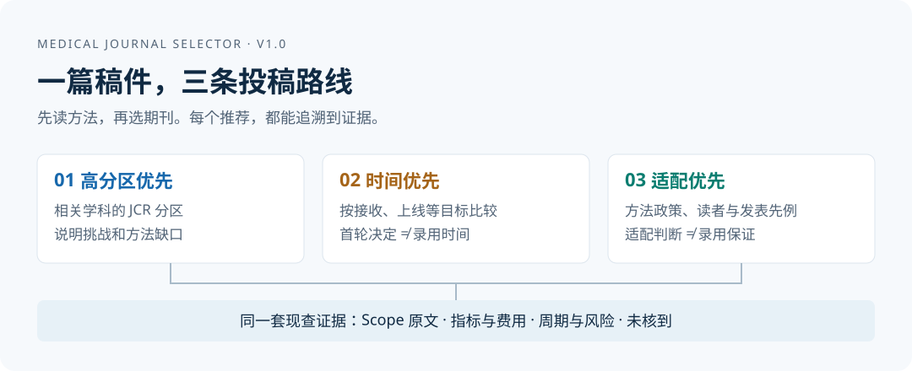

# Medical Journal Selector｜医学选刊助手

**读懂文章的方法，再比较期刊。一次给出高分区、时间、适配三条投稿路线，每项数字和状态现查，查不到就写「未核到」。**

[English](docs/README.en.md) · [下载 V1.0.0](https://github.com/hujizhou35-cmd/medical-journal-selector/releases/tag/v1.0.0) · [安装教程](docs/getting-started.md) · [查看完整示例](docs/examples/README.md)

## 从这里开始

只需选择你正在使用的 Agent。**不需要四个文件全部下载。**

| 你使用什么 | 推荐入口 | 下载后怎么做 |
|---|---|---|
| **Codex** | [下载 `.skill`](https://github.com/hujizhou35-cmd/medical-journal-selector/releases/download/v1.0.0/medical-journal-selector-v1.0.0.skill) | 将文件交给 Codex，复制下面的安装指令；[详细步骤](docs/getting-started.md#codex) |
| **Claude Code** | [下载便携 ZIP](https://github.com/hujizhou35-cmd/medical-journal-selector/releases/download/v1.0.0/medical-journal-selector-portable-v1.0.0.zip) | 解压后把 `medical-journal-selector` 文件夹放到 `.claude/skills/`；[详细步骤](docs/getting-started.md#claude-code) |
| **其他能读取文件并联网的 Agent** | [下载 `SKILL.md`](https://github.com/hujizhou35-cmd/medical-journal-selector/releases/download/v1.0.0/SKILL.md) | 提供文件，要求按其流程读取稿件并选刊 |
| **需要 Codex Plugin 包** | [下载 Plugin ZIP](https://github.com/hujizhou35-cmd/medical-journal-selector/releases/download/v1.0.0/medical-journal-selector-codex-plugin-v1.0.0.zip) | 包含同一个 Skill；[安装说明与兼容边界](docs/getting-started.md#codex-plugin) |

给 Codex 的安装指令：

```text
请安装我提供的 medical-journal-selector .skill 文件。
这是 ZIP 格式的 Skill 包。请把它解压到本项目 .agents/skills/medical-journal-selector/，
确认这个目录内直接包含 SKILL.md，然后检查是否能够调用。
若已有同名版本，先比较版本，不要直接覆盖我的修改。
```

## 三步完成选刊

1. **提供稿件。** 最好有全文和补充方法；只有摘要也能开始，但会说明判断限制。
2. **说明要求。** JCR 分区、是否必须 SCIE、预算、OA 偏好、排除名单，以及需要何时接收／上线／检索。
3. **比较三条路线。** 每条最多 3 本，期刊可以重叠；看推荐理由、Scope 原文、费用、周期、风险和待核验项。

复制这段话就能开始：

```text
使用 medical-journal-selector 帮我选刊。我已提供稿件。
请先识别研究领域、文章类型、数据来源和验证方式，缺少关键条件时集中问我。
同时给出高分区优先、时间优先、适配优先三条路线。
每本期刊请引用官网 Aims & Scope 原文，并现查收录、JCR、影响因子、
审稿周期、OA、版面费和预警风险，附来源和核验时间；查不到写“未核到”。
```

## 你会得到什么



| 路线 | 适合谁 | 比较什么 |
|---|---|---|
| **高分区优先** | 希望争取更高分区 | 基本适配通过后，比较相关学科的已核验 JCR |
| **时间优先** | 有时间要求 | 按接收／上线等实际目标比较同口径周期，揭示不确定性 |
| **适配优先** | 重视方法和读者契合 | 当前方法政策、文章类型、具体 Scope 和近期发表先例 |

完整报告还包括每本期刊的证据卡、待核验名单、排除理由，以及选定目标后的投稿信交接材料。

- [虚构教学示例](docs/examples/fictional-report.md)：看清三条路线为什么会不同。期刊、来源和数字均为虚构。
- [真实联网核验示例](docs/examples/live-report.md)：虚构稿件＋真实期刊的注明日期的核验快照。缺失字段如实保留。
- [检查与兼容记录](docs/validation.md)：哪些操作已验证，哪些能力有边界。

## 数据是怎样核验的

**所有变化字段都在每次运行时重新查询。** 指标附年度，JCR 附学科类别，费用附币种和适用条件，周期分清首轮决定、接收、上线与检索。没有可靠证据时统一写 **未核到**。

官方来源优先：期刊官网、Clarivate、NLM 和原始预警名单。PubMed、Europe PMC 和 Crossref 帮助寻找并核对相似论文。未配付费 JCR 权限也能使用，但不能保证查到每本期刊的分区。

三条路线共享证据，均服从你的硬条件。未知硬条件进入待核验区；当前政策不允许的文章类型或方法会被排除。没有期刊满足条件时，明确说明，不凑名单。

## 常见问题

**覆盖哪些文章？** 临床、护理、基础实验、公共数据库、生信、预测模型、网络药理／毒理、综述、Meta 分析、文献计量及病例报告等。具体方法要求按文章和期刊检查。

**NHANES 等文章怎样处理？** 优先查最近 24 个月的同类先例和现行政策，区分独立外部验证、内部划分、数据库重叠和独立复现。其他类型通常查近 5 年并侧重近期。

**能告诉我录用概率吗？** 不能。已发表文章没有提供全部投稿和拒稿的分母。方法适配、发表先例和期刊整体统计都不能换算成你的录用概率。

**需要额外购买 GPT API 吗？** 不需要。使用你所在 Agent 的模型和联网能力；该 Agent 自身的订阅／调用费用照常适用。辅助脚本需要 Python 3.10+，不运行脚本也可按便携指令工作。

**没有联网工具能用吗？** 可以整理稿件和检索计划，但不能输出声称已完成现查的排名。

**怎么更新？** 下载新 Release，备份自己的修改，再替换同名 Skill 文件夹。不要同时安装多个同名副本。[安装与更新教程](docs/getting-started.md)

## 选好期刊以后

选定目标后，可把稿件事实、Scope 引文、适配理由、来源和待核验事项交给 [Journal Cover Letter Skill](https://github.com/hujizhou35-cmd/journal-cover-letter-tutorial) 继续写投稿信。

## 开发、隐私与许可

- [流程、来源设计与参考作品](docs/design.md)
- [隐私说明](docs/privacy.md) · [贡献指南](CONTRIBUTING.md) · [版本记录](CHANGELOG.md)
- [开发与测试](development/README.md)

公开示例使用虚构稿件。不要把未公开手稿、患者信息、访问密钥或付费数据库内容提交到公开 Issue。

作者：**Jizhou Hu**。代码及原创文档采用 [MIT License](LICENSE)。期刊名称、引文和链接对应原始权利人；本项目不代表出版社、Clarivate 或任何 Agent 厂商。引用信息见 [CITATION.cff](CITATION.cff)。
